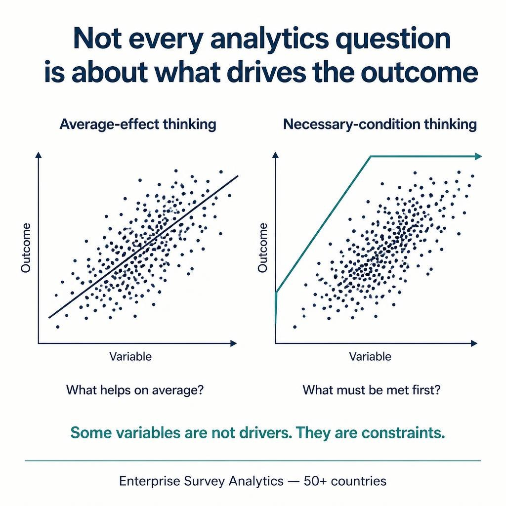

# Necessary Conditions vs Drivers

A project page about an analytical distinction that is often missed in data science: some questions are about average drivers, while others are about necessary conditions.

## Project Website

[View Project Site](https://mah-trigui.github.io/necessary-conditions-vs-drivers/)

## Overview

Most analytics methods answer a familiar question:

- what improves the outcome on average?

That naturally leads to:
- correlation
- regression
- feature importance
- SHAP-like interpretation

But some business and policy questions are different:

- what must already be true for high performance to even be possible?

This project focuses on that second framing using **Necessary Condition Analysis (NCA)**.

## Core Idea

Regression tells you that a variable is associated with better outcomes on average.

NCA tells you that below a certain threshold, the target simply does not reach high values.

That is a shift from:
- **driver analysis**
to:
- **constraint analysis**

## Why it matters

- changes the analytical question before changing the method
- surfaces structural bottlenecks
- helps distinguish “helpful” factors from “required” factors
- is useful in policy, enterprise performance, and capability assessment

## Architecture

## Key Takeaway

**Some variables are not drivers. They are constraints.**

## Public Scope

This repository shares the project framing, method explanation, and portfolio presentation only.
